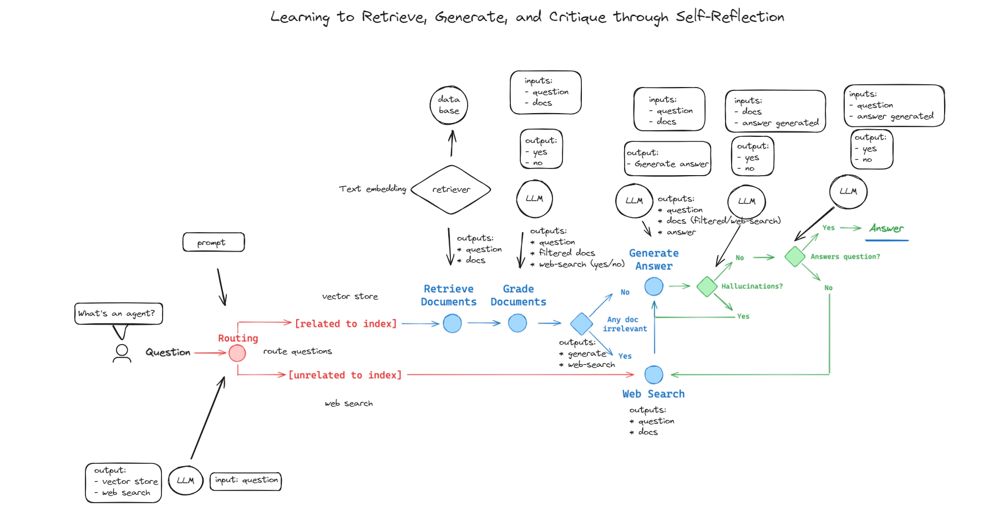

## Advanced RAG Application with LangGraph

Welcome to the repository for building an advanced Retrieval-Augmented Generation (RAG) application using LangGraph. This project demonstrates how to create an adaptive and self-reflective RAG system while preventing hallucinations. It also showcases the integration of an agent that retrieves information via a search browser using Tavily and leverages GROQ to speedup inference.

🎥 **Watch the full tutorial on YouTube:** [Advanced RAG Application with LangGraph Tutorial](https://www.youtube.com/yourvideo)

### Key Features:
- **Adaptive and Self-Reflective RAG**
- **Preventing Hallucinations**
- **Agent-Based Information Retrieval with Tavily**
- **GROQ for LLM inference**
- **Chroma as a vector store database**
- **LangGraph**
 
Don't forget to check out the video, like, comment, and subscribe for more advanced tutorials!

If you found the content helpful, consider subscribing to my 
[YouTube channel](https://www.youtube.com/channel/UCYZ_si4TG801SAuLrNl-v-g?sub_confirmation=1) to support me.
